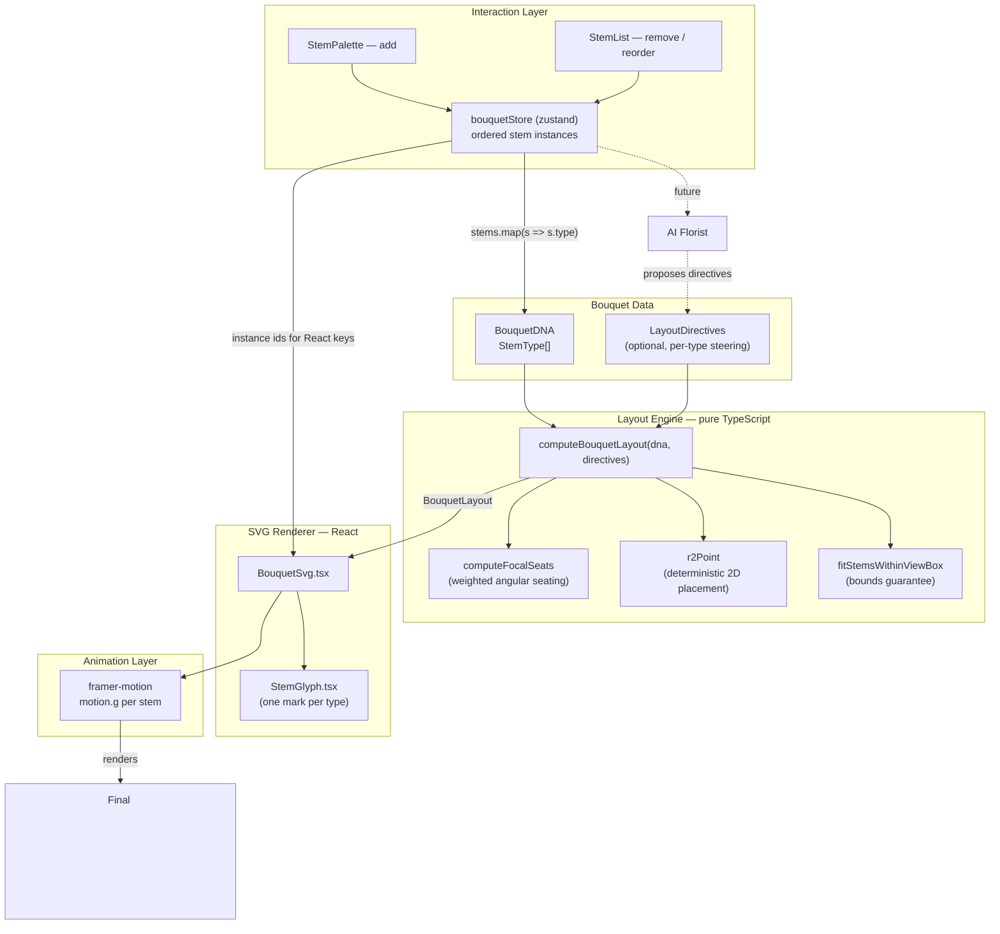

# Studio Bouquet Composition Engine

Internal engineering documentation for the bouquet renderer that powers `/studio`. This is the foundation the rest of Studio (AI Florist, timeline, undo, collaboration) builds on, so it's documented in more depth than a typical feature.

Code lives under `src/features/studio/`:

```
src/features/studio/
  bouquet/                        pure engine — no React, no DOM, no SVG
    types.ts                      StemType, BouquetDNA, LayoutStem, LayoutDirectives
    stemLibrary.ts                per-type florist metadata (angle, radius, depth, scale)
    deterministicRandom.ts        hashString, mulberry32, r2Point — generic, bouquet-agnostic
    layoutEngine.ts                computeBouquetLayout(dna, directives) -> BouquetLayout
    index.ts                      barrel export of the three files above
  components/bouquet/             renderer + interaction (React)
    StemGlyph.tsx                 one SVG mark per stem type
    BouquetSvg.tsx                 renderer: layout -> <svg>, framer-motion per stem
    StemPalette.tsx               add-stem controls
    StemList.tsx                  remove / reorder controls
    BouquetBuilder.tsx             wires bouquetStore to BouquetSvg + controls
  state/
    bouquetStore.ts                zustand store: ordered stem instance list
    studioStore.ts                 unrelated: which Studio screen is showing
```

---

## Overview

### Why this engine exists

`/studio` lets a customer build a bouquet stem by stem instead of picking a fixed catalogue arrangement. That only works if the result looks like something a florist made, not a pile of icons — and if the same bouquet always looks the same, because it's about to be the thing customers save, share, and eventually let an AI florist and other people edit.

### Design goals

1. **Deterministic.** Same `BouquetDNA` in → same layout out, always. No `Math.random`, no reliance on render order, no hidden mutable state.
2. **Layered, not tangled.** Data, layout, rendering, interaction, and animation are five separate concerns in five separate places. Each one is replaceable without touching its neighbours.
3. **Framework-agnostic core.** The part that decides *where a flower goes* has zero React/DOM/SVG knowledge. It's the same reason it's safe to call from a server, a share-link preview, or a future AI Florist tool — none of which want to drag React along.
4. **Steerable without a rewrite.** "Move the lilies higher" should be a data change (a `LayoutDirectives` entry), not a new code path.
5. **Controlled, not free-form — for now.** Users add/remove/reorder; the engine places. Unrestricted drag-and-drop is deliberately deferred (see [Known Limitations](#known-limitations)) so the florist-quality layout has a chance to prove itself before users can override it by hand.

---

## Architecture



The arrows only go one way: **data → layout → render → pixels**. Interaction writes to the store, never to the layout or the SVG directly — it changes the *input*, and everything downstream recomputes. That's what makes "the engine rebalances after every edit" true by construction rather than by convention.

### Layer responsibilities

| Layer | File(s) | Knows about | Must never know about |
|---|---|---|---|
| Bouquet DNA | `bouquet/types.ts` | Stem types, ordering | Pixels, React, pricing |
| Layout Engine | `bouquet/layoutEngine.ts` | Geometry, florist placement rules | React, SVG, DOM, the store |
| SVG Renderer | `components/bouquet/BouquetSvg.tsx`, `StemGlyph.tsx` | How to draw a `LayoutStem` | Where the data came from, pricing, the store |
| Interaction | `state/bouquetStore.ts`, `StemPalette.tsx`, `StemList.tsx` | User intent (add/remove/reorder) | Geometry, SVG markup |
| Animation | `framer-motion` props inside `BouquetSvg.tsx` | How to transition between two layouts | Nothing extra — it's a thin layer over the renderer's numbers |

This was verified directly, not just designed: `bouquet/*.ts` has zero imports of `react`, `zustand`, or anything SVG-specific — confirmed by reading every import in that directory. If a future change adds one, that's the signal the boundary broke.

---

## Rendering Pipeline

Exactly how a `BouquetDNA` becomes pixels, end to end:

1. **Store holds instances.** `bouquetStore.stems` is `{ id, type }[]` — `id` is a React-key-only concern invented by the store (`stem-0`, `stem-1`, …), never seen by the engine.
2. **`BouquetSvg` derives DNA.** `stems.map(s => s.type)` turns the store's instances into the engine's only required input, memoized so it's a new array reference only when the stems actually change.
3. **Engine computes layout.** `computeBouquetLayout(dna, directives)` runs synchronously and returns a `LayoutStem[]` — one entry per input stem, same order, each with `x`, `y`, `rotation`, `scale`, `depth`, `zIndex`. Nothing async, nothing that touches the network or the DOM.
4. **Renderer zips data with geometry.** `BouquetSvg` pairs `stems[i]` (has the React key) with `layout.stems[i]` (has the numbers), sorts the pairs by `zIndex` for back-to-front paint order.
5. **Each stem becomes an independent SVG layer.** A `<motion.g data-stem-type="...">` per stem, with `<StemGlyph type={...} />` inside drawing that type's fixed artwork. The `g`'s only job is position/rotation/scale; the glyph's only job is what it looks like.
6. **Stem lines and the wrap band are drawn first** (plain `<line>`/`<ellipse>`, not per-type), so they always sit behind the flower heads regardless of paint order.
7. **`framer-motion` owns the transition**, not the developer: `animate={{ x, y, rotate, scale }}` on each `motion.g` — a spring interpolates from wherever that stem was to wherever the new layout put it. Adding a stem animates in from the grip point (`initial`); removing one shrinks out (`exit`) via `AnimatePresence`.

The engine never draws anything and the renderer never decides where anything goes — step 3 and step 5 are the hard boundary.

---

## Deterministic Layout

### Why determinism is the whole point

A bouquet a customer built needs to be:
- **Saved** — reload the page, get the same bouquet back.
- **Shared** — send someone a link, they see what you built, not an approximation.
- **The basis of "Bouquet DNA"** — a short, stable identifier for *this exact arrangement*, useful for save/load and (eventually) recreating it from a reference photo or a saved template.
- **Editable predictably** — add one stem, and only the layout that stem's presence actually affects should move; the other nine shouldn't visibly reshuffle for no reason.

None of that holds if layout involves `Math.random()`, `Date.now()`, iteration-order-dependent `Set`/`Map` behavior, or anything else that isn't a pure function of the input. `computeBouquetLayout` is checked for exactly this: calling it twice on the same `dna` (including a freshly-cloned array, to rule out any accidental identity-based caching) produces byte-identical output, verified both as a standalone script and by diffing the actual rendered `<svg>` `transform` values across a full page reload.

### The tools that make "deterministic but not obviously repetitive" possible

**FNV-1a hashing** (`deterministicRandom.ts`) turns a string (a stem's `"type:index"` identity) into a 32-bit integer. It's not cryptographic — it doesn't need to be — it just needs to be fast, stable, and well-distributed enough that two different identities rarely hash close together.

**Mulberry32** is a tiny PRNG seeded by that hash. Same seed in → same sequence of pseudo-random numbers out, forever, on any machine, in any JS engine. This is what makes the small "organic" jitter (a few degrees of angle, a few percent of scale) reproducible instead of a new roll on every render.

**Why not `Math.random()`:** it can't be seeded. Two calls to `computeBouquetLayout` with identical input would produce different jitter, which breaks every guarantee above. Every source of variation in this engine is either a pure function of the input data (stem type, position in the array) or derived from `hashString` + `mulberry32` — never the ambient `Math.random`.

**The R2 low-discrepancy sequence** (also `deterministicRandom.ts`) is the other half: it generates a 2D point sequence (via the plastic number, ~1.3247) that covers an area evenly, for any prefix length, with no clustering — the same principle behind phyllotaxis/sunflower-seed patterns in generative art. It's used to place same-type stems *within* their allotted seat so they fill an area instead of stringing out along one line (see below for why that mattered).

---

## Layout Algorithm

The mental model is a hand-tied bouquet: every stem is a straight line from one **grip point** (`BOUQUET_GRIP`, fixed near the bottom of the frame) to a flower head somewhere in a dome above it. `computeBouquetLayout` decides, per stem: what angle it leaves the grip at, how long its stem is (radius), how big and rotated its head is, and how far forward or back it sits.

### Focal seating

Distinct **focal** types (rose, tulip, lily, gerbera, carnation) each get their own angular **seat** across a fixed dome arc (±62°), in the order they first appear in the DNA — `computeFocalSeats`. This is the fix for a real bug found during review: without seats, a lone tulip and a lone lily both defaulted to the dome's centreline and hid each other. Reordering the DNA reassigns seats, which is the mechanism behind "reordering stems rebalances the bouquet," not a side effect bolted on afterward.

A seat's width isn't equal by default — it's weighted by `focalSeatWeight(count)`, a sqrt-dampened function of how many stems of that type exist, so a bouquet of 20 roses and 1 tulip gives roses most of the dome instead of splitting it evenly. Stems only fill ~78% of their seat's width (`seatFillFactor`); the unused margin is a gutter that keeps stems near one seat's edge from crowding the neighbouring seat.

**Filler and greenery** (eucalyptus, baby's-breath, greenery) don't get a private seat — they're meant to weave through the whole width behind the focal blooms, which is also just how they're used in real arrangements.

### Radius, depth, scale, rotation

- **Radius** (stem length) comes from a per-type `radiusBand` in `stemLibrary.ts` — lily reaches further out than carnation, matching how those blooms are typically held. The band's outer edge grows with `sqrt(count)` of that type too (`radialDensityGrowth`), same reasoning as seat width: more stems of one kind need more room, not the same room more crowded.
- **Depth** (back-to-front position, 0–1) comes from a per-type `depthBand` — greenery is always further back than focal blooms — modulated by radius, so within a type the ones sitting closer to the grip read as slightly more forward.
- **Scale** combines the type's base size, a depth-based factor (things further forward read larger), and a small deterministic jitter.
- **Rotation** partially follows the stem's own outward angle (so it reads as "pushed out from the grip," not just floating), plus a small per-type jitter range.

### Collision avoidance

This was the single biggest finding of the pre-commit review: the first version derived both angle and radius from the *same* `occurrence / total` ratio for a type, so same-type stems fell along one thin arc instead of covering an area — verified by a stress-test script that flagged real overlaps (worst case: two stems only 3–6px apart while needing ~20px of clearance) at stem counts as low as 10.

The fix has three parts, all in `computeBouquetLayout`:

1. **R2-sequence placement.** Angle and radius for the *n*-th stem of a type come from `r2Point(n)`'s two decorrelated coordinates, not the same ratio — same-type stems fill their seat's area instead of lining up.
2. **Per-type phase offset** (`typePhaseOffset`, a stable hash of the type name). Without it, two *different* types at the same occurrence count sample the same point in the R2 sequence and can land on top of each other where their ranges overlap — a real bug caught by the stress test at high stem-diversity counts, fixed by giving every type its own phase into the sequence.
3. **`fitStemsWithinViewBox`**, run once after every stem is placed: finds how far the bouquet's true extent exceeds the frame (if at all) and scales every stem's distance from the grip — and its own size — down by one uniform factor. Because it's uniform, it changes nothing about *relative* spacing (whether two stems collide is scale-invariant), it only guarantees the whole bouquet fits inside `BOUQUET_VIEWBOX`. A heavy bouquet is allowed to want more room than the frame has; this step is the "zoom to fit" that reconciles the two.

All three combined: every realistic bouquet size and composition tested (1 stem through a 35-stem "maximum realistic" catalogue-style arrangement, single-type-heavy, all-8-types mixed, greenery-only) renders with no clipping and no meaningful overlap. See [Known Limitations](#known-limitations) for the one synthetic pattern that still shows a tight pair.

### Layer ordering

Paint order (`zIndex`) is assigned once, after every stem has a `depth`: sort all stems by depth ascending, stable on original array index for ties. Greenery paints first (furthest back), then filler, then focal blooms — always, by construction, because `zIndex` is derived from `depthBand`, not from insertion order.

---

## State Management

`bouquetStore` (zustand) owns exactly one thing: an ordered list of `{ id, type }` stem instances, plus `addStem` / `removeStem` / `moveStem`. That's the entire API surface — no derived layout, no SVG, no memoized geometry lives in the store.

**Rendering stays stateless with respect to layout** on purpose: `BouquetSvg` never reads or writes layout to/from the store. Every render, it recomputes `computeBouquetLayout(stems.map(s => s.type))` fresh (cheaply — memoized with `useMemo` so it only reruns when `stems` actually changes). This means:

- There's no way for the store's data and the rendered layout to drift out of sync — they can't, because the layout is a pure function of the store's current data, computed on demand, not cached state that could go stale.
- The store could be swapped for anything else that produces the same `{id, type}[]` shape (a server response, a URL-decoded share link, a future timeline scrubber) with zero changes to the renderer.

`id` is deliberately *not* part of what the engine sees. Two bouquets with the same type sequence are the same bouquet even if their instance ids differ — ids exist purely so React and `framer-motion` can track "this specific DOM node" across add/remove/reorder for correct enter/exit animation.

---

## Extension Points

The architecture was shaped by these, even though none of them are built yet:

- **AI Florist.** `LayoutDirectives` (`{ lily: { heightBias: 0.4 } }`) already flows into `computeBouquetLayout` as an optional second argument, per-type, with `heightBias` / `spreadBias` / `scaleBias` knobs. "Move the lilies higher" is a directive object, not a new rendering code path. The AI's job becomes proposing directives (or DNA edits); it never touches SVG or the engine's internals.
- **Undo/Redo.** Because the store's entire state is one serializable array, undo is "keep a history of past `stems` arrays and swap back to one" — a zustand middleware (e.g. `zundo`) or a hand-rolled stack, without the engine or renderer knowing undo exists.
- **Timeline.** Same shape as undo, played forward: a sequence of DNA snapshots with timestamps. The renderer already re-renders correctly for any DNA it's given, so scrubbing a timeline is just feeding it different `dna` values over time.
- **Bouquet DNA (save/load, sharing).** `BouquetDNA` is already `StemType[]` — trivially serializable (`JSON.stringify`, or a denser custom encoding later for shorter share URLs) and sufficient on its own to reproduce the exact layout on any device, since layout has no external state dependency.
- **Collaboration.** Because layout is a pure function of DNA, two clients holding the same DNA are guaranteed to render identically — the hard part of collaborative editing (converging on the same visual state) is already solved by determinism. What's left is standard state-sync (CRDT/OT over the DNA array), not anything specific to this engine.
- **Drag-and-drop.** Deliberately not built yet (see below), but the seam is clear: it would be a new mode in the interaction layer that, on drop, either reorders the DNA (staying within the current controlled model) or introduces manual per-stem position overrides that the layout engine would need to accept as additional input — a decision to make deliberately later, not by accident now.

---

## Performance

- **Layout computation** is `O(n log n)` in stem count (dominated by the two sorts — paint order, and the seat-weight partition), with small constant factors (a handful of trig calls and array passes per stem). At realistic bouquet sizes (5–35 stems) this is sub-millisecond; even the 60-stem stress case is not a measurable render-time concern in practice.
- **Memoization:** `BouquetSvg` computes `dna` and `layout` via `useMemo`, keyed on the `stems` reference — recomputation only happens when the store's array actually changes, not on every render. The `layers` array (data + geometry zipped and sorted for paint order) is likewise memoized.
- **Why per-stem `React.memo` was deliberately not added:** almost any edit (add, remove, reorder) legitimately changes most or all stems' positions, because seating and density scaling are relative to the *whole* bouquet, not just the changed stem. Memoizing individual stem components would rarely skip work and would add complexity for no measured benefit — this was a conscious call, not an oversight.
- **Render strategy:** every stem is a real DOM node (`<motion.g>` + its glyph's shapes) — no canvas, no virtualization. Fine at the sizes this UI supports; would need reconsidering only if the product grew to support hundreds of stems, which isn't a near-term goal.
- **Future optimization opportunities**, in likely order of relevance: memoize `StemGlyph`'s static shape data at the module level if profiling ever shows it (it already is, effectively — `GLYPHS` is a module-level `Record`, not recreated per render); consider a coarser paint-order recompute (skip the full sort when only depth-irrelevant properties changed) if bouquets grow much larger; if drag-and-drop lands, watch for layout thrashing from computing layout on every pointer-move frame rather than only on drop.

---

## Known Limitations

Intentionally not implemented, or intentionally imperfect, as of this phase:

- **No unrestricted drag-and-drop.** Add/remove/reorder only. This is a deliberate sequencing choice (see [Overview](#overview)), not a technical blocker.
- **No AI Florist yet.** `LayoutDirectives` exists and is exercised by the layout engine, but nothing currently produces a directive automatically.
- **No undo/redo, timeline, save/load, or sharing UI yet.** The data model supports all four (see [Extension Points](#extension-points)); none has a UI or persistence layer built.
- **One synthetic stress case still shows a tight pair.** A 50-stem bouquet evenly cycling through all 8 stem types (an artificial pattern — no catalogue product lists anywhere near that stem-type diversity; real "maximum realistic" bouquets, e.g. 35 stems weighted toward 3–4 dominant types, pass cleanly) can place two *filler* stems (which intentionally share space rather than getting private seats) close together. Since filler always paints behind focal blooms by depth band, this reads as "one filler mostly hidden," not a broken render — documented rather than "fixed" by compromising filler's intentional behavior.
- **No product-level cap on stem count.** The engine handles large counts gracefully (auto-fit guarantees containment), but nothing in the UI currently stops a user from adding an unrealistic number of stems. Worth a soft product-level limit if this becomes user-facing beyond internal testing.
- **Glyphs are static per type**, not per-instance — every rose looks like every other rose. Intentional for now (keeps the renderer simple and the "independent layer" promise easy to reason about); an AI Florist or a "vary the blooms" feature would need per-instance visual variation later.
- **No keyboard-accessible reordering beyond the existing up/down buttons** (which *are* keyboard-accessible) — there's no drag-based interaction to make accessible yet, so this is really a note for whenever drag-and-drop is added: it must ship with an equivalent keyboard path from day one.

---

## Future Roadmap

The stated plan, in order:

1. **Interaction** (this phase) — add/remove/reorder, engine-driven rebalancing. Done.
2. **AI Florist** — wire natural-language requests to `LayoutDirectives`, starting with the height/spread/scale knobs that already exist.
3. **Timeline** — sequence of DNA snapshots, scrubbing, likely sharing infrastructure with undo/redo.
4. **Undo/Redo** — history stack over the store's `stems` array.
5. **Collaboration** — sync DNA across clients; determinism means rendering is already guaranteed consistent once the data is.
6. **Drag-and-drop** — introduced deliberately, once the above have proven the controlled layout is trustworthy enough to be worth letting users override.

Not yet scheduled, but supported by this architecture without a rewrite: save/load, share links, photo-to-bouquet recreation ("prompt builder"), community templates, and a wedding/bulk mode (large, repeated-type arrangements — already the best-tested case in the stress suite).
